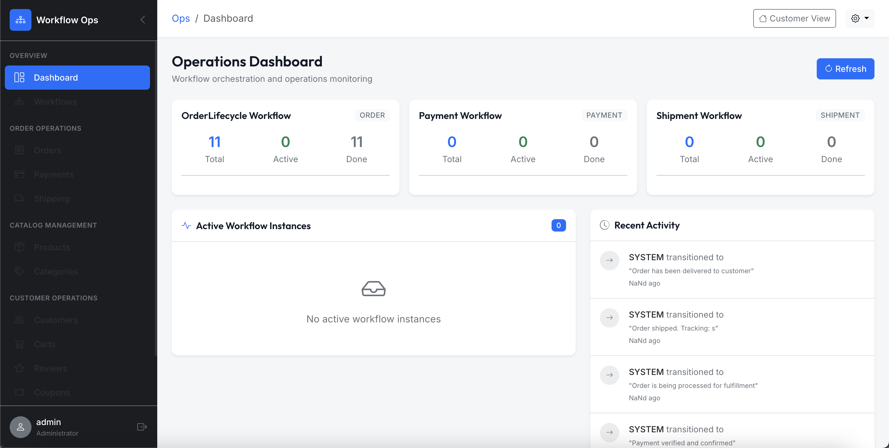
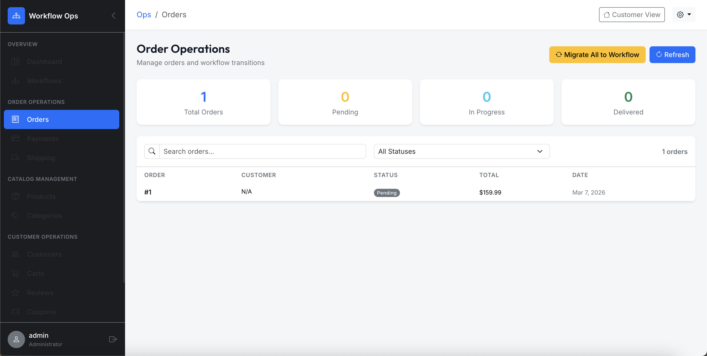
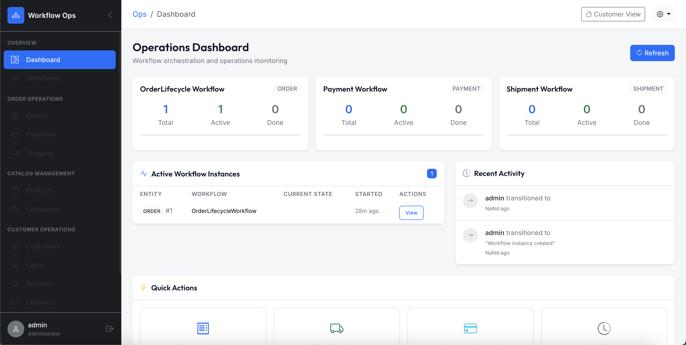
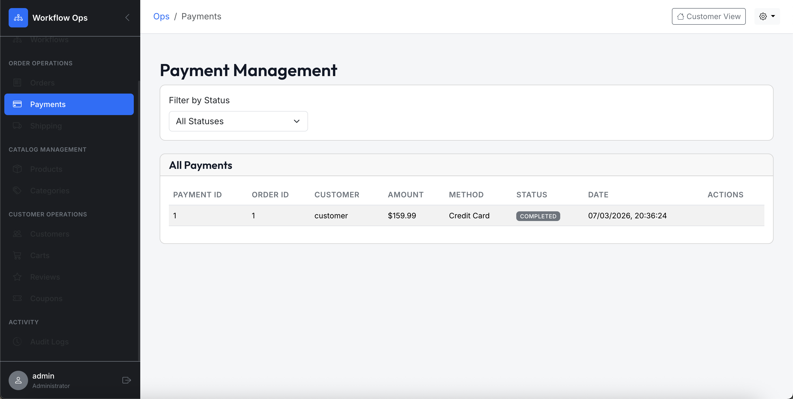
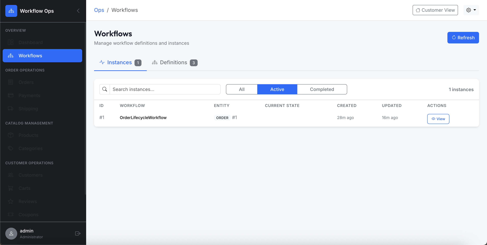
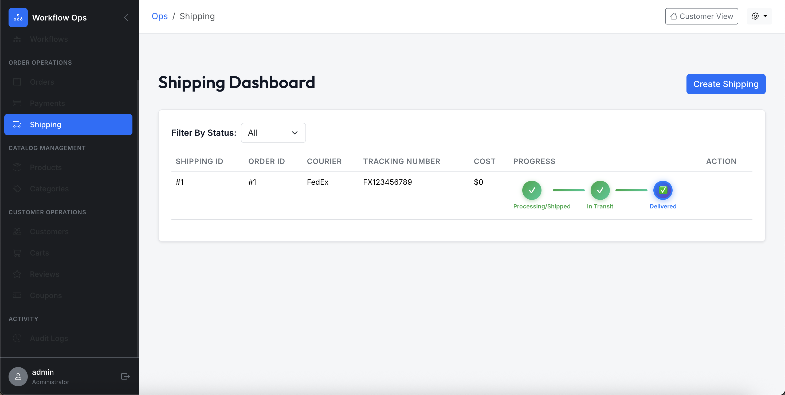

# workflow-commerce-system

**Production-grade workflow orchestration engine** for managing transactional lifecycles with deterministic state machines.

[](https://openjdk.org/)
[](https://spring.io/projects/spring-boot)
[](https://react.dev/)
[](https://www.mysql.com/)
[](LICENSE)

> **Not a traditional e-commerce app.** This is an **internal operations platform** for workflow lifecycle management—similar to how Stripe, Square, and Uber build internal systems for transaction processing.

---

## Key Features

| Feature | Description |
|---------|-------------|
| **State Machine Engine** | Domain-agnostic workflow orchestration for any business entity |
| **Business Rule Validation** | Prevents invalid transitions (e.g., can't ship without payment) |
| **Complete Audit Trail** | Every state change logged with actor, timestamp, context |
| **Role-Based Transitions** | Fine-grained RBAC for workflow operations |
| **Event-Driven Architecture** | Async processing with Spring Events |
| **Optimistic Locking** | Concurrent modification protection with `@Version` |
| **Security Headers** | CSP, HSTS, X-Frame-Options, X-Content-Type-Options |

---

## Screenshots

<table>
<tr>
<td width="50%">

### Operations Dashboard
Real-time metrics showing active workflows, order pipeline status, and KPI cards for monitoring system throughput.



</td>
<td width="50%">

### Order Operations
Interactive order lifecycle management with status tracking, workflow state transitions, and action controls.



</td>
</tr>
<tr>
<td width="50%">

### Audit Logs
Chronological event log capturing every state transition with performer identity, timestamps, and action context.



</td>
<td width="50%">

### Payment Management
Payment processing interface with transaction status, payment method tracking, and order-payment linking.



</td>
</tr>
<tr>
<td width="50%">

### Workflows
Workflow definitions and state machine configurations with visual state diagrams and transition rules.



</td>
<td width="50%">

### Shipping Dashboard
Shipment tracking and fulfillment management with courier details, tracking numbers, and delivery status.



</td>
</tr>
</table>

---

## System Architecture

```
┌──────────────────────────────────────────────────────────────────────────────┐
│                              CLIENT LAYER                                    │
│    React 19 SPA │ Bootstrap 5 │ React Router 7 │ Axios + Interceptors        │
│    ┌─────────────────┐  ┌─────────────────┐  ┌─────────────────────────────┐ │
│    │  AuthContext    │  │  CartContext    │  │  ErrorBoundary              │ │
│    │  (JWT + RBAC)   │  │  (State Mgmt)   │  │  (Graceful Error Handling)  │ │
│    └─────────────────┘  └─────────────────┘  └─────────────────────────────┘ │
├──────────────────────────────────────────────────────────────────────────────┤
│                            SECURITY LAYER                                    │
│    ┌──────────────────────────────────────────────────────────────────────┐  │
│    │  Spring Security 6 Filter Chain                                      │  │
│    │  ├─ JWT Authentication (HS256)                                       │  │
│    │  ├─ Role-Based Access Control (@PreAuthorize)                        │  │
│    │  ├─ Security Headers (CSP, HSTS, X-Frame-Options)                    │  │
│    │  ├─ Rate Limiting (100 req/min/IP)                                   │  │
│    │  └─ BCrypt Password Hashing (Strength 10)                            │  │
│    └──────────────────────────────────────────────────────────────────────┘  │
├──────────────────────────────────────────────────────────────────────────────┤
│                            SERVICE LAYER                                     │
│    ┌─────────────────────────────┐  ┌──────────────────────────────────────┐ │
│    │     WORKFLOW ENGINE         │  │        DOMAIN SERVICES               │ │
│    │  ┌───────────────────────┐  │  │  ┌────────────────────────────────┐  │ │
│    │  │ WorkflowEngineService │  │  │  │ OrderService    PaymentService │  │ │
│    │  │ ├─ State Machine      │  │  │  │ ShippingService CartService    │  │ │
│    │  │ ├─ @Retryable(3x)     │  │  │  │ ProductService  UserService    │  │ │
│    │  │ └─ @Cacheable         │  │  │  │ CouponService   ReviewService  │  │ │
│    │  └───────────────────────┘  │  │  └────────────────────────────────┘  │ │
│    │  ┌───────────────────────┐  │  │  ┌────────────────────────────────┐  │ │
│    │  │ TransitionExecutor    │  │  │  │ Spring Events (Async)          │  │ │
│    │  │ └─ @Transactional     │  │  │  │ ├─ PaymentCompletedEvent       │  │ │
│    │  │    (REQUIRES_NEW)     │  │  │  │ ├─ ShippingConfirmedEvent      │  │ │
│    │  └───────────────────────┘  │  │  │ └─ OrderCancelledEvent         │  │ │
│    │  ┌───────────────────────┐  │  │  └────────────────────────────────┘  │ │
│    │  │ OrderRuleValidator    │  │  │                                      │ │
│    │  │ └─ Business Rules     │  │  │                                      │ │
│    │  └───────────────────────┘  │  │                                      │ │
│    └─────────────────────────────┘  └──────────────────────────────────────┘ │
├──────────────────────────────────────────────────────────────────────────────┤
│                          PERSISTENCE LAYER                                   │
│    ┌──────────────────────────────────────────────────────────────────────┐  │
│    │  MySQL 8.0 │ JPA/Hibernate 6 │ HikariCP (20 connections)             │  │
│    │  ├─ Optimistic Locking (@Version on Order, Product, Payment)         │  │
│    │  ├─ Indexed Queries (workflow_instances, orders, payments)           │  │
│    │  └─ Audit Logging (workflow_logs with actor, timestamp, context)     │  │
│    └──────────────────────────────────────────────────────────────────────┘  │
└──────────────────────────────────────────────────────────────────────────────┘
```

---

## Business Logic Flow

```
┌─────────────────────────────────────────────────────────────────────────────────┐
│                           ORDER LIFECYCLE FLOW                                  │
└─────────────────────────────────────────────────────────────────────────────────┘

  CUSTOMER                    SYSTEM                         ADMIN
     │                          │                              │
     │  1. Create Order         │                              │
     │─────────────────────────▶│                              │
     │                          │                              │
     │                    ┌─────▼─────┐                        │
     │                    │  CREATED  │                        │
     │                    └─────┬─────┘                        │
     │                          │ Auto-transition              │
     │                    ┌─────▼─────────────┐                │
     │                    │ PAYMENT_PENDING   │                │
     │                    └─────┬─────────────┘                │
     │                          │                              │
     │  2. Process Payment      │                              │
     │─────────────────────────▶│                              │
     │                          │                              │
     │               ┌──────────┴──────────┐                   │
     │               ▼                     ▼                   │
     │        ┌──────────┐          ┌───────────┐              │
     │        │   PAID   │          │ CANCELLED │              │
     │        └────┬─────┘          └───────────┘              │
     │             │                (Payment Failed)           │
     │             │                                           │
     │             │  3. Validate Business Rules               │
     │             │  ✓ Payment.status = COMPLETED             │
     │             │  ✓ Order.totalAmount > 0                  │
     │             │                                           │
     │       ┌─────▼──────┐                                    │
     │       │ PROCESSING │◀───────────────────────────────────│ 4. Admin Confirms
     │       └─────┬──────┘                                    │
     │             │ 5. Validate Shipping Rules                │
     │             │ ✓ Shipping record exists                  │
     │             │ ✓ TrackingNumber assigned                 │
     │             │                                           │
     │       ┌─────▼─────┐                                     │
     │       │  SHIPPED  │◀────────────────────────────────────│ 6. Admin Ships
     │       └─────┬─────┘                                     │
     │             │ 7. Delivery Confirmation                  │
     │             │ ✓ Shipping.status = Delivered             │
     │             │                                           │
     │       ┌─────▼──────┐                                    │
     │       │ DELIVERED  │ ← Terminal State (Success)         │
     │       └────────────┘                                    │
     │                                                         │
     │  ─ ─ ─ ─ ─ ─ ─ ─ REFUND PATH ─ ─ ─ ─ ─ ─ ─ ─           │
     │                                                         │
     │       From: PAID, PROCESSING, SHIPPED                   │
     │             │                                           │
     │             │ 8. Refund Request                         │
     │             │ ✓ Admin provides comment                  │
     │             │ ✓ Payment.status → REFUNDED               │
     │             │                                           │
     │       ┌─────▼──────┐                                    │
     │       │  REFUNDED  │ ← Terminal State                   │
     │       └────────────┘                                    │
     │                                                         │
└─────┴─────────────────────────────────────────────────────────┴─────────────────┘
```

---

## Order Workflow State Machine

```
┌─────────┐    ┌─────────────────┐    ┌──────┐    ┌────────────┐    ┌─────────┐    ┌───────────┐
│ CREATED │───▶│ PAYMENT_PENDING │───▶│ PAID │───▶│ PROCESSING │───▶│ SHIPPED │───▶│ DELIVERED │
└────┬────┘    └────────┬────────┘    └──┬───┘    └─────┬──────┘    └────┬────┘    └───────────┘
     │                  │                │              │                │           (Terminal)
     ▼                  ▼                ▼              ▼                ▼
┌─────────┐      ┌─────────┐       ┌─────────┐    ┌─────────┐      ┌─────────┐
│CANCELLED│      │CANCELLED│       │ REFUNDED│    │ REFUNDED│      │ REFUNDED│
└─────────┘      └─────────┘       └─────────┘    └─────────┘      └─────────┘
(Terminal)       (Terminal)        (Terminal)     (Terminal)       (Terminal)
```

### Transition Rules & Business Validation
| Transition | Business Rules | Authorized Roles |
|------------|----------------|------------------|
| CREATED → PAYMENT_PENDING | Auto-transition on order creation | SYSTEM, USER, ADMIN |
| PAYMENT_PENDING → PAID | `Payment.status = COMPLETED` | SYSTEM, ADMIN |
| PAYMENT_PENDING → CANCELLED | `Payment.status = FAILED` or user cancel | USER, ADMIN |
| PAID → PROCESSING | Auto-transition after payment verified | SYSTEM, ADMIN |
| PROCESSING → SHIPPED | `Shipping record exists`, `TrackingNumber != null` | ADMIN |
| SHIPPED → DELIVERED | `Shipping.status = Delivered` | ADMIN, SYSTEM |
| PAID/PROCESSING/SHIPPED → REFUNDED | Comment required, triggers `PaymentRefundedEvent` | ADMIN |

---

## Event-Driven Architecture

```
┌─────────────────────────────────────────────────────────────────────────────┐
│                         EVENT FLOW DIAGRAM                                  │
└─────────────────────────────────────────────────────────────────────────────┘

┌──────────────┐     publishes     ┌─────────────────────────┐
│ PaymentSvc   │──────────────────▶│ PaymentCompletedEvent   │
└──────────────┘                   └───────────┬─────────────┘
                                               │ @EventListener
                                               ▼
                                   ┌─────────────────────────┐
                                   │ WorkflowIntegrationSvc  │
                                   │ └─ Transition to PAID   │
                                   └───────────┬─────────────┘
                                               │ @Async
                                               ▼
                                   ┌─────────────────────────┐
                                   │ WorkflowEngineService   │
                                   │ ├─ Validate Rules       │
                                   │ ├─ Execute Transition   │
                                   │ └─ Log Audit Entry      │
                                   └─────────────────────────┘

┌──────────────┐     publishes     ┌─────────────────────────┐
│ ShippingSvc  │──────────────────▶│ ShippingConfirmedEvent  │
└──────────────┘                   └───────────┬─────────────┘
                                               │
                                               ▼
                                   ┌─────────────────────────┐
                                   │ WorkflowIntegrationSvc  │
                                   │ └─ Transition DELIVERED │
                                   └─────────────────────────┘

┌──────────────┐     publishes     ┌─────────────────────────┐
│ RefundSvc    │──────────────────▶│ PaymentRefundedEvent    │
└──────────────┘                   └───────────┬─────────────┘
                                               │
                                               ▼
                                   ┌─────────────────────────┐
                                   │ WorkflowIntegrationSvc  │
                                   │ └─ Transition REFUNDED  │
                                   └─────────────────────────┘
```

---

## Security Implementation

```
┌─────────────────────────────────────────────────────────────────────────────┐
│                         SECURITY ARCHITECTURE                               │
└─────────────────────────────────────────────────────────────────────────────┘
                                    
                    Request
                       │
                       ▼
         ┌─────────────────────────┐
         │    Rate Limiter         │  100 req/min/IP
         │    (Bucket4j)           │
         └───────────┬─────────────┘
                     │
                     ▼
         ┌─────────────────────────┐
         │   Security Headers      │
         │   ├─ CSP                │  default-src 'self'
         │   ├─ HSTS               │  max-age=31536000
         │   ├─ X-Frame-Options    │  DENY
         │   └─ X-Content-Type     │  nosniff
         └───────────┬─────────────┘
                     │
                     ▼
         ┌─────────────────────────┐
         │   JWT Auth Filter       │
         │   └─ HS256 Validation   │  24h expiry
         └───────────┬─────────────┘
                     │
           ┌─────────┴─────────┐
           ▼                   ▼
    ┌─────────────┐     ┌─────────────┐
    │  ROLE_USER  │     │ ROLE_ADMIN  │
    │  ├─ Orders  │     │ ├─ All User │
    │  ├─ Cart    │     │ ├─ Workflow │
    │  ├─ Profile │     │ ├─ Products │
    │  └─ Reviews │     │ └─ Reports  │
    └─────────────┘     └─────────────┘

         Password Requirements:
         ┌────────────────────────┐
         │ • Min 8 characters     │
         │ • 1 uppercase letter   │
         │ • 1 lowercase letter   │
         │ • 1 number             │
         │ • 1 special character  │
         │ • BCrypt hashed        │
         └────────────────────────┘
```

---

## Tech Stack

| Layer | Technologies |
|-------|--------------|
| **Frontend** | React 19, Vite 6, Bootstrap 5, Axios + Interceptors, React Router 7 |
| **State Management** | React Context (AuthContext, CartContext), ErrorBoundary |
| **Backend** | Spring Boot 3.2, Spring Security 6, Spring Events, JPA/Hibernate 6 |
| **Auth & Security** | JWT (HS256), BCrypt, RBAC, CSP, HSTS, Rate Limiting |
| **Database** | MySQL 8.0, HikariCP, Optimistic Locking (@Version) |
| **Resilience** | @Retryable (3 attempts), @Cacheable, Transaction Isolation |
| **DevOps** | Docker, Render (Backend), Vercel (Frontend) |

---

## Database Schema

```
┌─────────────────────────────────────────────────────────────────────────────┐
│                           DATABASE SCHEMA                                   │
└─────────────────────────────────────────────────────────────────────────────┘

  WORKFLOW ENGINE TABLES                    DOMAIN ENTITY TABLES
  ══════════════════════                    ════════════════════
  
  ┌────────────────────────┐               ┌────────────────────────┐
  │ workflow_definitions   │               │ users                  │
  │ ├─ id (PK)             │               │ ├─ id (PK)             │
  │ ├─ name (UNIQUE)       │               │ ├─ username (UNIQUE)   │
  │ ├─ entity_type         │               │ ├─ email (UNIQUE)      │
  │ └─ is_active           │               │ ├─ password (BCrypt)   │
  └─────────┬──────────────┘               │ └─ status              │
            │                              └─────────┬──────────────┘
            │ 1:N                                    │
            ▼                                        │ M:N
  ┌────────────────────────┐               ┌────────▼───────────────┐
  │ workflow_states        │               │ user_roles             │
  │ ├─ id (PK)             │               │ ├─ user_id (FK)        │
  │ ├─ workflow_id (FK)    │               │ └─ role_id (FK)        │
  │ ├─ state_name          │               └────────┬───────────────┘
  │ ├─ is_initial          │                        │
  │ └─ is_terminal         │               ┌────────▼───────────────┐
  └─────────┬──────────────┘               │ roles                  │
            │                              │ ├─ id (PK, BIGINT)     │
            │ 1:N                          │ └─ name (ROLE_*)       │
            ▼                              └────────────────────────┘
  ┌────────────────────────┐
  │ workflow_transitions   │               ┌────────────────────────┐
  │ ├─ id (PK)             │               │ orders                 │
  │ ├─ workflow_id (FK)    │               │ ├─ order_id (PK)       │
  │ ├─ from_state_id (FK)  │◀─────────────▶│ ├─ user_id (FK)        │
  │ ├─ to_state_id (FK)    │               │ ├─ workflow_instance_id│
  │ └─ allowed_roles       │               │ ├─ total_amount        │
  └────────────────────────┘               │ ├─ order_status        │
                                           │ └─ version (Optimistic)│
  ┌────────────────────────┐               └─────────┬──────────────┘
  │ workflow_instances     │                         │ 1:N
  │ ├─ id (PK)             │◀────────────────────────┘
  │ ├─ workflow_id (FK)    │               ┌────────────────────────┐
  │ ├─ entity_type         │               │ order_items            │
  │ ├─ entity_id           │               │ ├─ id (PK)             │
  │ ├─ current_state_id    │               │ ├─ order_id (FK)       │
  │ └─ is_completed        │               │ ├─ product_id (FK)     │
  └─────────┬──────────────┘               │ └─ price_at_purchase   │
            │                              └────────────────────────┘
            │ 1:N
            ▼                              ┌────────────────────────┐
  ┌────────────────────────┐               │ payments               │
  │ workflow_logs (AUDIT)  │               │ ├─ payment_id (PK)     │
  │ ├─ id (PK)             │               │ ├─ order_id (FK,UNIQUE)│
  │ ├─ instance_id (FK)    │               │ ├─ amount              │
  │ ├─ from_state          │               │ ├─ payment_status      │
  │ ├─ to_state            │               │ └─ version (Optimistic)│
  │ ├─ performed_by        │               └────────────────────────┘
  │ ├─ performed_at        │
  │ └─ comment             │               ┌────────────────────────┐
  └────────────────────────┘               │ products               │
                                           │ ├─ product_id (PK)     │
                                           │ ├─ sku (UNIQUE)        │
                                           │ ├─ category_id (FK)    │
                                           │ ├─ inventory_count     │
                                           │ └─ version (Optimistic)│
                                           └────────────────────────┘
```

---

## Quick Start

### Prerequisites
- Java 17+ | Node.js 18+ | MySQL 8.0+

### Backend
```bash
cd Backend
cp .env.example .env  # Configure your database credentials
./mvnw spring-boot:run
# API: http://localhost:8080
```

### Frontend
```bash
cd Frontend
npm install && npm run dev
# App: http://localhost:5173
```

### Environment Variables
```bash
# Backend (.env)
DB_URL=jdbc:mysql://localhost:3306/workflow_commerce
DB_USERNAME=root
DB_PASSWORD=your_password
JWT_SECRET=your_256_bit_secret_key

# Frontend (.env)
VITE_API_URL=http://localhost:8080/api/auth/
```

### Default Credentials
| Role | Username | Password |
|------|----------|----------|
| Admin | `admin` | `Admin@123` |
| Customer | `customer` | `Customer@123` |

---

## API Highlights

| Method | Endpoint | Description |
|--------|----------|-------------|
| `POST` | `/api/auth/signup` | User registration (password policy enforced) |
| `POST` | `/api/auth/signin` | JWT authentication |
| `GET` | `/api/workflow/definitions` | List workflow definitions |
| `GET` | `/api/workflow/instances/{id}` | Get instance with audit logs |
| `POST` | `/api/workflow/instances/{id}/transition` | Execute state transition |
| `GET` | `/api/workflow/logs/recent` | Recent audit entries |
| `GET` | `/api/workflow/stats` | Workflow statistics (Admin) |

### Example: Execute Transition
```bash
curl -X POST 'http://localhost:8080/api/workflow/instances/1/transition' \
  -H 'Authorization: Bearer <token>' \
  -H 'Content-Type: application/json' \
  -d '{"targetState": "PROCESSING", "comment": "Payment verified"}'
```

---

## Project Structure

```
workflow-commerce-system/
├── Backend/
│   └── src/main/java/com/example/workflowcommerce/
│       ├── controller/           # REST endpoints (12 controllers)
│       ├── service/
│       │   └── workflow/         # State machine engine
│       │       ├── WorkflowEngineService.java      # Core state machine
│       │       ├── WorkflowTransitionExecutor.java # Transaction isolation
│       │       ├── OrderWorkflowRuleValidator.java # Business rules
│       │       └── WorkflowIntegrationService.java # Event handlers
│       ├── model/                # JPA entities with @Version
│       ├── security/             # JWT + RBAC + Security Headers
│       ├── dto/                  # Request/Response DTOs
│       └── exception/            # Custom exceptions + GlobalHandler
├── Frontend/
│   └── src/
│       ├── components/
│       │   ├── ErrorBoundary.jsx # Graceful error handling
│       │   └── Navbar.jsx
│       ├── contexts/
│       │   ├── AuthContext.jsx   # Centralized auth state
│       │   └── CartContext.jsx
│       ├── pages/
│       │   ├── Operations/       # Workflow dashboard
│       │   ├── Admin/            # Entity management
│       │   └── Customer/         # Shopping experience
│       ├── services/             # API integration (env-based URLs)
│       └── utils/
│           └── axiosInterceptor.js # Global error handling
├── screenshots/
└── workflow-commerce-system_Complete_SQL.sql    # Database schema + seed data
```

---

## Technical Highlights

| Feature | Implementation |
|---------|----------------|
| **Concurrency Control** | Optimistic locking with `@Version` on Order, Product, Payment |
| **Transaction Isolation** | `REQUIRES_NEW` propagation prevents cascade failures |
| **Retry Logic** | `@Retryable(maxAttempts=3)` for transient failures |
| **Caching** | `@Cacheable` on workflow definitions |
| **Audit Trail** | Every transition logged with actor, role, timestamp, comment |
| **Input Validation** | Jakarta Bean Validation with custom password pattern |
| **Error Handling** | GlobalExceptionHandler + React ErrorBoundary |

---

<p align="center">
  <strong>workflow-commerce-system</strong> — Workflow Orchestration Engine<br>
  <em>Built with Spring Boot 3 + React 19</em><br>
  <sub>Designed for enterprise-grade transaction lifecycle management</sub>
</p>
---
- Author : Yash Lone


